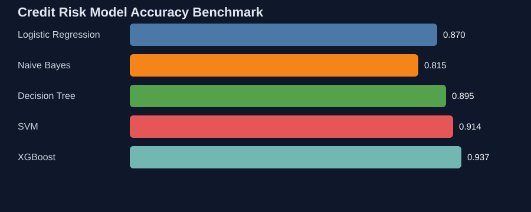
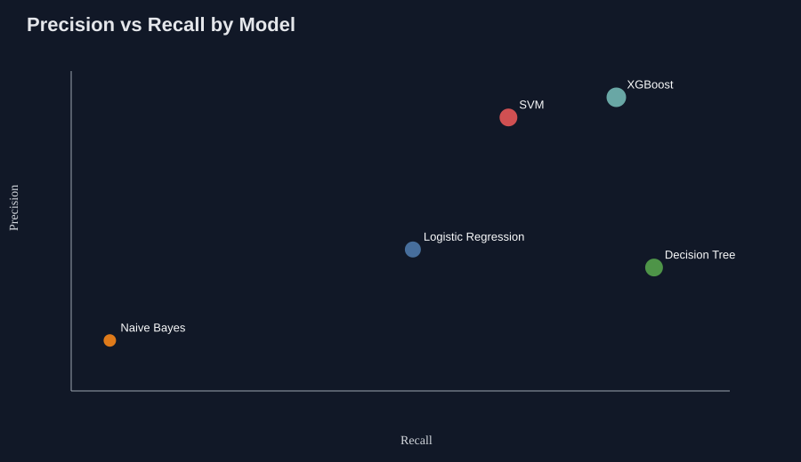
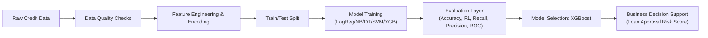

# Credit Risk Model — End-to-End ML Case Study for Risk, Analytics & Data Roles

<p align="center">
  
  
  
</p>

This repository demonstrates a **credit risk classification project** that starts with notebook experimentation and is now packaged as a portfolio-ready case study with recruiter-friendly documentation, benchmarking visuals, and reproducible artifacts.

---

## Why this project stands out

- **Business relevance:** Predicts loan eligibility / credit default risk using realistic classification metrics.
- **Model benchmarking:** Compares 5 algorithms (LogReg, Naive Bayes, Decision Tree, SVM, XGBoost).
- **Cross-functional appeal:** Useful for **Data Engineering**, **Data Analytics**, **Risk Analytics**, and **Data Science** interviews.
- **Portfolio-ready storytelling:** Includes architecture view, impact framing, and performance visuals.

---

## Benchmark Snapshot

The metrics below come from the notebook evaluation (`Working_Code_Extended.ipynb`) and are exported to `docs/assets/model_metrics.csv`.





| Model | Accuracy | F1 Score | Recall | Precision |
|---|---:|---:|---:|---:|
| Logistic Regression | 0.8695 | 0.6581 | 0.5757 | 0.7680 |
| Naive Bayes | 0.8150 | 0.4250 | 0.3135 | 0.6600 |
| Decision Tree | 0.8949 | 0.7651 | 0.7845 | 0.7467 |
| SVM | 0.9138 | 0.7692 | 0.6584 | 0.9249 |
| **XGBoost** | **0.9370** | **0.8389** | **0.7518** | **0.9489** |

---

## Project Architecture (Interview-Friendly)



---

## Repository Structure

```text
Credit-Risk-Model/
├── README.md
├── Working_Code_Extended.ipynb
├── docs/
│   └── assets/
│       ├── model_benchmark.svg
│       ├── precision_recall_tradeoff.svg
│       └── model_metrics.csv
├── scripts/
│   └── generate_project_visuals.py
├── src/
│   └── project_summary.py
├── tests/
│   └── test_metrics_integrity.py
└── requirements.txt
```

---

## Quick Start

### 1) Clone
```bash
git clone https://github.com/rishipandey2403/CodeBase007.git
cd CodeBase007
```

### 2) (Optional) Install dependencies
```bash
pip install -r requirements.txt
```

### 3) Run notebook
Open `Working_Code_Extended.ipynb` and execute cells in order.

### 4) Regenerate portfolio visuals
```bash
python scripts/generate_project_visuals.py
```

### 5) Validate exported metrics
```bash
python -m unittest discover -s tests
```

---

## Tech Stack

- Python
- Jupyter Notebook
- Scikit-learn
- XGBoost
- Pandas / NumPy / Matplotlib / Seaborn (in notebook workflow)
- SVG + CSV artifacts for lightweight documentation visuals

---

## What recruiters can evaluate from this repo

### Data Engineering Signals
- Structured artifact generation (`scripts/generate_project_visuals.py`) from model outputs.
- Reproducible project layout with checks (`tests/test_metrics_integrity.py`).

### Data Analytics Signals
- Comparative KPI table (Accuracy/F1/Recall/Precision).
- Visual communication of model tradeoffs (benchmark + precision-recall chart).

### Risk Analytics Signals
- Metric emphasis on **recall vs precision**, aligned with default-risk tradeoff handling.
- Transparent comparison of interpretable and non-linear models.

### Data Science Signals
- Multi-model experimentation and evaluation.
- Evidence-based model selection (XGBoost best overall performance in this run).

---

## Future Enhancements

- Add probability calibration and threshold optimization for risk policy tuning.
- Introduce SHAP explainability for model governance and regulator-facing transparency.
- Wrap best model into a lightweight API for underwriting simulation.
- Add CI checks for notebook execution and artifact freshness.

---

## Author

**Rishi Pandey**  
If you're a recruiter or hiring manager, this project can be discussed from either an ML modeling perspective or an end-to-end analytics engineering perspective.
